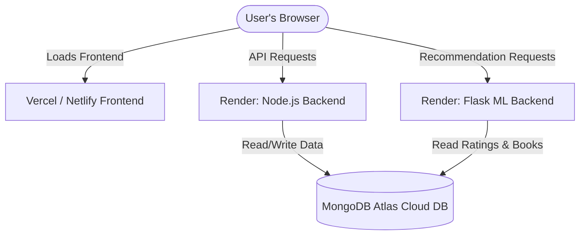

# Mind Maze Books Deployment Guide 🚀

This guide walks you through deploying the **Mind Maze Books** project onto the web using cloud platform providers:
- **Database**: MongoDB Atlas (Free Shared Cluster)
- **Backend (Node.js/Express)**: Render (Web Service)
- **ML Backend (Python/Flask)**: Render (Web Service)
- **Frontend (React/Vite)**: Vercel or Netlify (Static Hosting)

---

## 🗺️ Architectural Flow

Once deployed, the project components will interact as follows:



---

## 🛠️ Step-by-Step Deployment Plan

### Phase 1: MongoDB Atlas (Database Setup)
To allow both cloud-hosted backends to access your data, you must migrate from a local MongoDB instance to a cloud MongoDB Atlas instance.

1. **Sign Up / Log In**: Go to [MongoDB Atlas](https://www.mongodb.com/cloud/atlas/register) and create a free account.
2. **Create a Database Cluster**:
   - Choose the **M0 FREE** tier (Shared Cluster).
   - Select a cloud provider (e.g., AWS) and region nearest to you.
   - Click **Create**.
3. **Database Security (Important)**:
   - **Username & Password**: Create a database user (e.g., `admin`) and generate a secure password. Save these credentials.
   - **IP Access List**: To allow cloud platforms like Render to access your database, add `0.0.0.0/0` (Allow Access from Anywhere) to the IP access list.
4. **Get the Connection String**:
   - Click **Connect** on your Cluster dashboard.
   - Select **Drivers** (Node.js).
   - Copy the connection string. It will look like:
     `mongodb+srv://<username>:<password>@cluster0.xxxx.mongodb.net/?retryWrites=true&w=majority&appName=Cluster0`
   - Replace `<username>` and `<password>` with your database user credentials.
   - Set the database name by appending it after `/` and before `?` (e.g., `...mongodb.net/mind_maze_books?retryWrites=...`).

---

### Phase 2: Deploying Node.js Backend on Render

1. **Sign Up / Log In**: Go to [Render](https://render.com/) and connect your GitHub repository.
2. **Create a New Web Service**:
   - Click **New +** -> **Web Service**.
   - Connect your GitHub repository containing the `mind-maze-books` code.
3. **Configure the Web Service**:
   - **Name**: `mind-maze-books-backend`
   - **Root Directory**: `backend`
   - **Runtime**: `Node`
   - **Build Command**: `npm install`
   - **Start Command**: `npm start`
   - **Instance Type**: `Free`
4. **Configure Environment Variables**:
   Under the **Environment** tab, add the following variables:
   - `MONGODB_URI`: *Your MongoDB Atlas connection string from Phase 1*
   - `JWT_SECRET`: *A secure random string (e.g. `your_production_secret_key_123!`)*
   - `NODE_ENV`: `production`
5. **Deploy**: Click **Deploy Web Service**. Render will build the backend and provide a public URL (e.g., `https://mind-maze-books-backend.onrender.com`).

---

### Phase 3: Deploying Flask ML Backend on Render

1. **Create a New Web Service**:
   - Click **New +** -> **Web Service** on Render.
   - Connect the same GitHub repository.
2. **Configure the Web Service**:
   - **Name**: `mind-maze-books-ml-backend`
   - **Root Directory**: `ml-backend`
   - **Runtime**: `Python`
   - **Build Command**: `pip install -r requirements.txt`
   - **Start Command**: `gunicorn app:app`
   - **Instance Type**: `Free`
3. **Configure Environment Variables**:
   Under the **Environment** tab, add:
   - `MONGODB_URI`: *Your MongoDB Atlas connection string from Phase 1*
4. **Deploy**: Click **Deploy Web Service**. Render will provision your Python environment, install scikit-learn/pandas, and provide a public URL (e.g., `https://mind-maze-books-ml-backend.onrender.com`).

---

### Phase 4: Deploying React Frontend on Vercel

Vercel is optimal for static React applications.

1. **Sign Up / Log In**: Go to [Vercel](https://vercel.com/) and log in with your GitHub account.
2. **Create a New Project**:
   - Click **Add New** -> **Project**.
   - Import your GitHub repository.
3. **Configure the Project**:
   - **Root Directory**: Select `frontend` (Vercel will prompt you to edit the directory).
   - **Framework Preset**: `Vite` (Vercel automatically detects this).
   - **Build Command**: `npm run build`
   - **Output Directory**: `dist`
4. **Configure Environment Variables**:
   Expand the **Environment Variables** section and add:
   - `VITE_API_BASE_URL`: `https://your-backend-url.onrender.com/api` (The Render URL from Phase 2 + `/api`)
   - `VITE_ML_BASE_URL`: `https://your-ml-backend-url.onrender.com/api` (The Render URL from Phase 3 + `/api`)
5. **Deploy**: Click **Deploy**. Vercel will build your static assets and publish them.

---

## ⚡ Seed Database Data (Optional but Recommended)

Once MongoDB Atlas is online, you should seed the database with initial books and ratings so your recommendations are populated:

1. Temporary configure your local project to use your remote Atlas database:
   Modify your local backend `.env` file to point `MONGODB_URI` to your Atlas connection string.
2. Run the seeding script locally:
   ```bash
   cd backend
   node scripts/seed.js
   ```
3. Once seeded, revert the local `.env` file back to your local MongoDB if you plan to keep developing locally.
