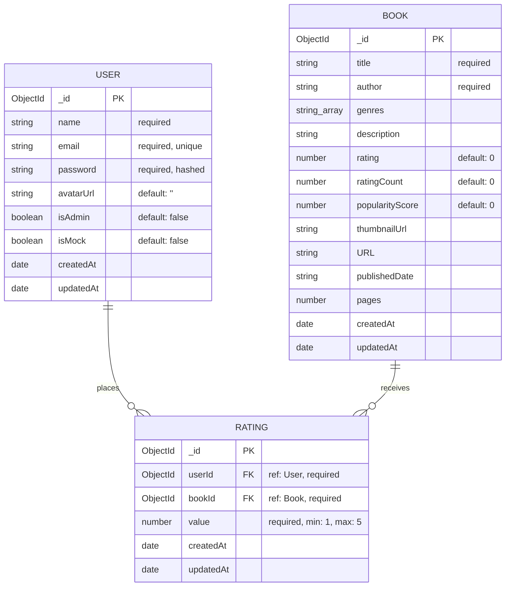

# Entity Relationship (ER) Diagram

This document presents the Entity-Relationship (ER) model of the **Mind Maze Books** database schema. 

The application utilizes a document-oriented database model via MongoDB and Mongoose, consisting of three primary collections: `User`, `Book`, and `Rating`.

---

## 📊 Mermaid ER Diagram

---

## 🔍 Collection Details & Constraints

### 1. `User` Collection
* **Primary Key**: `_id` (Auto-generated MongoDB ObjectId).
* **Constraints**:
  * `email` is indexed as **unique**.
  * Password is automatically hashed using **bcrypt** (10 salt rounds) on document pre-save trigger.

### 2. `Book` Collection
* **Primary Key**: `_id` (Auto-generated MongoDB ObjectId).
* **Indexes & Constraints**:
  * **Compound Unique Index**: `{ title: 1, author: 1 }` prevents duplicate book entries.
  * **Text Search Index**: `{ title: 'text', author: 'text', genres: 'text' }` powers the exact search querying.
  * **Cascade Delete Trigger**: Pre-query middleware automatically deletes all matching documents in the `Rating` collection when a book is deleted (one-by-one or in bulk).

### 3. `Rating` Collection
* **Primary Key**: `_id` (Auto-generated MongoDB ObjectId).
* **Foreign Keys**:
  * `userId`: References the `_id` field in the `User` collection.
  * `bookId`: References the `_id` field in the `Book` collection.
* **Indexes & Constraints**:
  * **Compound Unique Index**: `{ userId: 1, bookId: 1 }` guarantees that a user can only rate a specific book once.
  * `value` is validated to be an integer between `1` and `5`.
