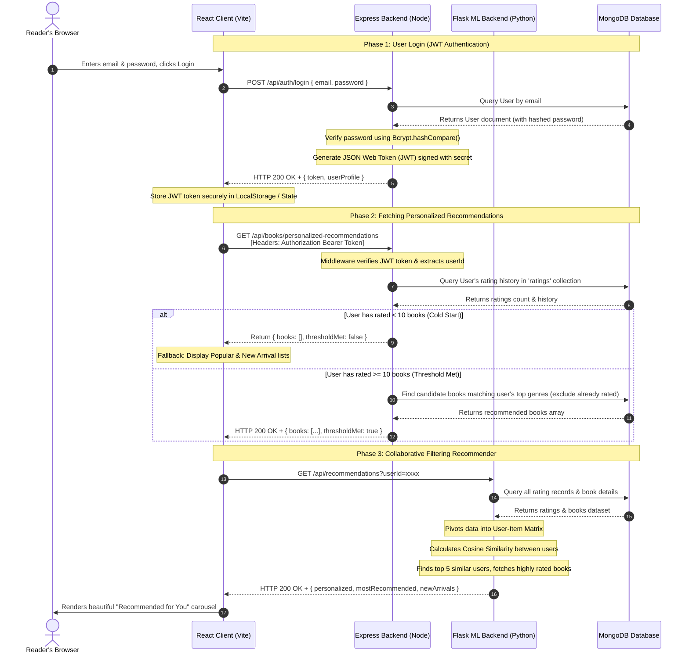

# System Sequence Diagram

This document presents the **System Sequence Diagram** showing the interaction flow between the **React Client (Frontend)**, **Express Backend (API)**, **Flask ML Backend (Recommendation Engine)**, and **MongoDB Database**.

---

## 📊 Sequence Diagram (Mermaid)

---

## 🔍 Detailed Step-by-Step Flow Explanation

### 1. Phase 1: Authentication (JWT Login)
1. **User Action**: The reader enters credentials on the Login page.
2. **API Request**: The React client sends a `POST` request to `/api/auth/login`.
3. **Database Query**: The Express backend searches for the user document in MongoDB using the provided email.
4. **Bcrypt Verification**: If the user exists, the backend uses `bcrypt.compare()` to check if the input password matches the hashed password stored in the database.
5. **JWT Generation**: Upon successful validation, the server signs a **JSON Web Token (JWT)** containing the user's ID and permissions.
6. **Response**: The server returns the JWT token and user details to the React client, which stores the token in local storage.

### 2. Phase 2: Core Recommendations (Express API)
1. **Authenticated Request**: The client requests `/api/books/personalized-recommendations` and sends the JWT token in the `Authorization` header.
2. **Token Extraction**: Express middleware verifies the token and extracts the `userId`.
3. **History Check**: The server checks how many books this user has rated.
4. **Conditional Retrieval**:
   * **If `< 10` ratings**: The API informs the client that the rating threshold is not met (Cold Start).
   * **If `≥ 10` ratings**: The server determines the user's favorite genres based on their ratings, queries MongoDB for books in those genres that the user has not read yet, and returns them.

### 3. Phase 3: Python ML Recommender Flow (Collaborative Filtering)
1. **ML Request**: The client requests `/api/recommendations` from the Flask server (port `5000`).
2. **Data Pipeline**: The Flask app fetches all ratings and books from MongoDB.
3. **Mathematical Computation**:
   * Pivots ratings into a **User-Item Matrix**.
   * Computes **Cosine Similarity** to find the 5 most similar readers.
   * Extracts books those users rated $\ge 4.0$ that the current user has not read.
4. **Display**: The recommendations are sent back to the React client, which dynamically renders them in the **"Recommended for You"** carousel.
